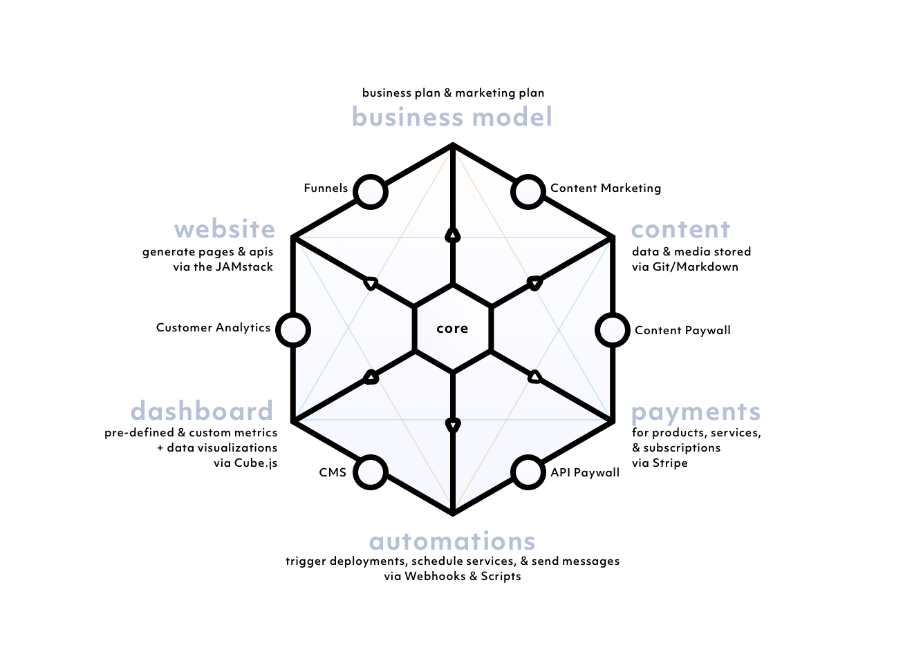

    <h1 style="margin-bottom:15px;margin-top:10px; border:none;font-weight:100;color:#000 !important;">Features</h1>

    PlatformKit has 7 key features.  
    

#### Pages
- Design beautiful landing pages with or without code.

#### Content
- Publish audio video, & written content.
- Sell individual items.
- Sell subscriptions.

#### Auth
- Allow users to register.
- Passwordless login via magic links sent by email.
- Control what content, pages, and APIs your users can access.
- Integrate with other applications via JWT (Javascript Web Tokens).

#### Analytics
- Integrate with major analytics/CRM apps.
- Track clicks, page views, conversions, & custom events.
- Circumvent adblockers by handling analytics on your own server.

#### Payments
- Charge for products, services, & subscriptions.
- Accept payments via credit card, Apple Pay, & Google Pay.

#### Web-Hooks
- Automate your dataflow with web-hooks.

#### Infrastructure
- Automate your infrastructure deployments with build scripts.